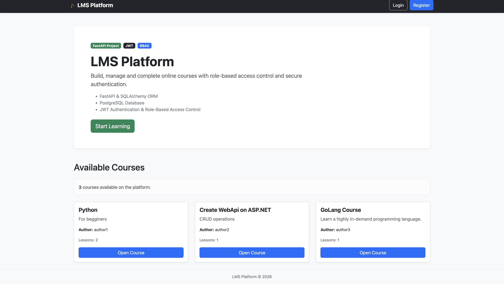
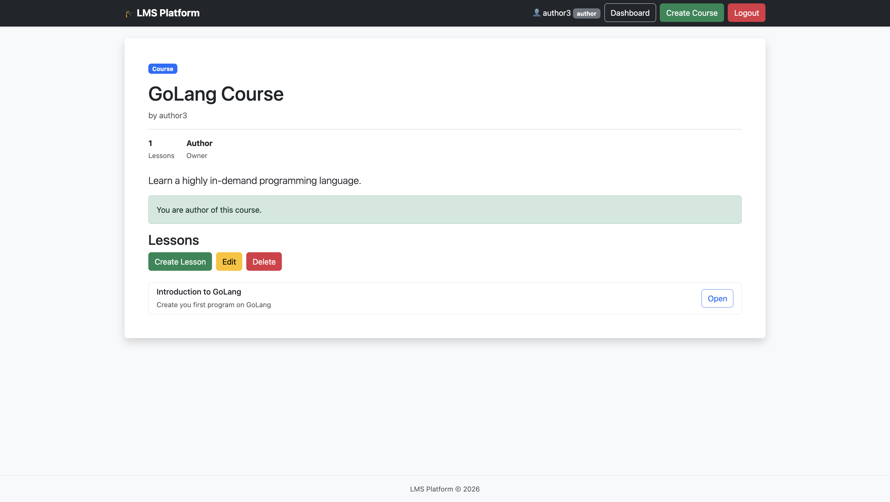
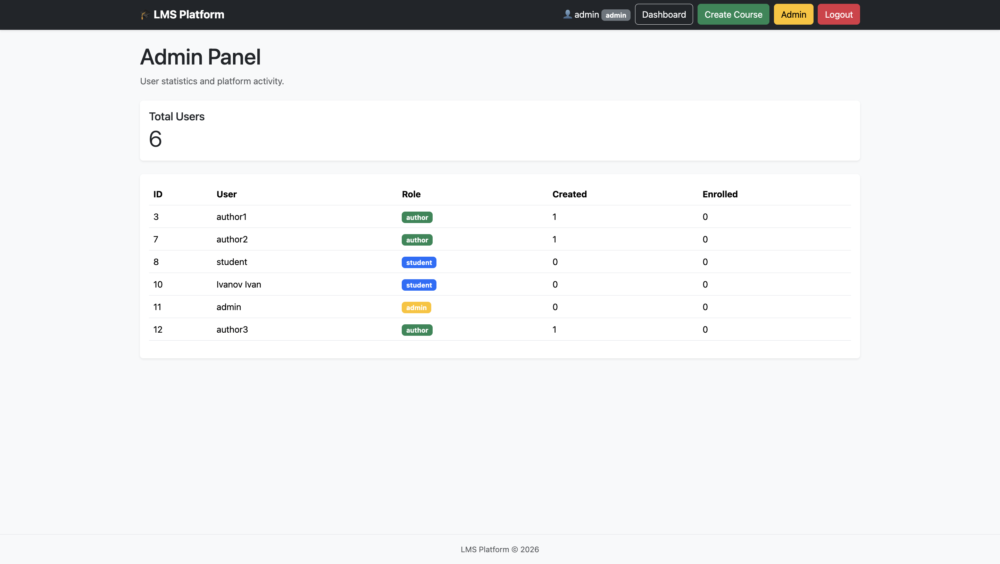

# Mini LMS — Learning Management System

Mini LMS is a web application for course management and learning built with FastAPI.

The application supports authentication, authorization, role-based access control, course creation, lesson management, enrollment, and administration features.

## Features

### Authentication & Security
* JWT authentication
* Password hashing
* Role-based access control (RBAC)
* Permission-based access
* Custom domain exceptions
* Centralized exception handling
* Password validation
* Logging system
* Rate limiting

### Courses
* Create courses
* Edit courses
* Delete courses
* Enroll in courses
* View available courses

### Lessons
* Create lessons
* View lessons
* Course access validation

### Administration
* Admin dashboard
* View users
* View created/enrolled courses
* Manage access levels

### Frontend
* Server-side rendering (Jinja2)
* Bootstrap 5
* Custom error pages
* Responsive layout

---

## Architecture

Router
↓
Dependency 
Layer
↓
Service
Layer
↓
Models / Database

Project follows layered architecture:

```text
app/
├── authorization/
├── core/
├── dependencies/
├── exceptions/
├── models/
├── routers/
│   ├── api/
│   └── frontend/
├── schemas/
├── services/
├── static/
├── templates/
├── validation/
└── main.py
```

---

## Technologies

* Python 3.14
* FastAPI
* SQLAlchemy
* PostgreSQL
* Alembic
* Jinja2
* Bootstrap 5
* JWT
* Pydantic
* Uvicorn

---

## Installation

Clone repository:
```bash
git clone <https://github.com/Vinogradovv12/mini-lms>
cd mini-lms
```

Create virtual environment:
```bash
python -m venv venv
```

Activate:

* **macOS / Linux**
  ```bash
  source venv/bin/activate
  ```
* **Windows**
  ```bash
  venv\Scripts\activate
  ```

Install dependencies:
```bash
pip install -r requirements.txt
```

Configure environment:
```env
DATABASE_URL=
SECRET_KEY=
ALGORITHM=
```

Run migrations:
```bash
alembic upgrade head
```

Start server:
```bash
python3 -m app.main
```
OR
```bash
uvicorn app.main:app --reload
```

Open:
[http://0.0.0.0:9090](http://0.0.0.0:9090)
OR
[http://127.0.0.1:8000](http://127.0.0.1:8000)
---

## Screenshots

### Home Page


### Course Page


### Admin Panel


---

## Implemented Improvements

* Custom domain exceptions
* API and frontend error separation
* Template-based rendering
* Response schemas
* Validation layer
* Logging
* Cleaner service architecture
* Permission dependencies

---

## Future Improvements

* Docker deployment
* Automated tests
* CI/CD
* Course analytics
* User management UI
* Cloud deployment

---

## Author

University Practice Project  
2026